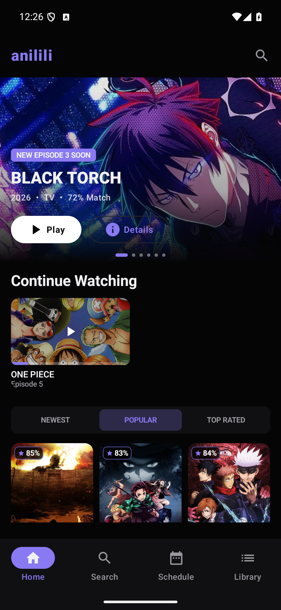
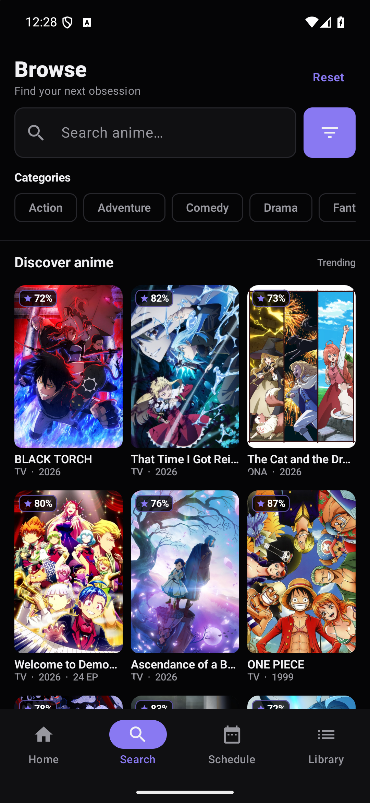
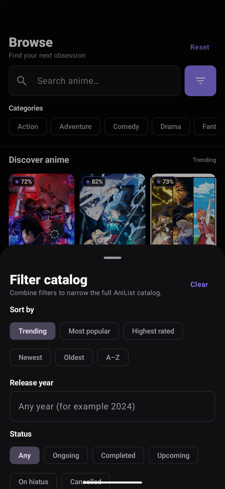
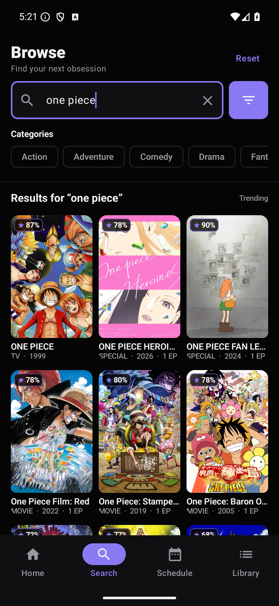
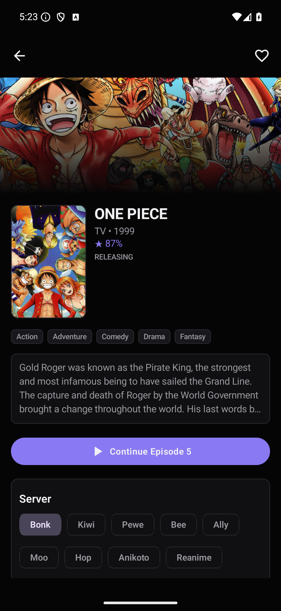
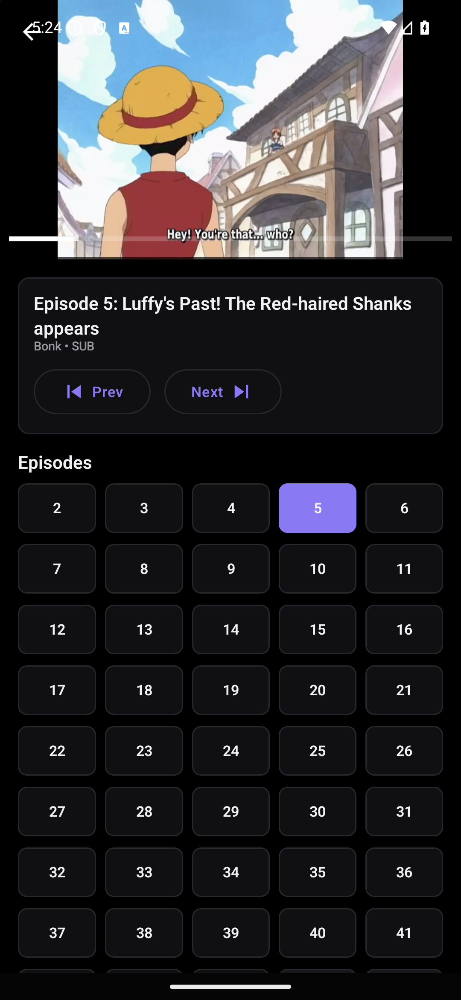

# Anilili

Anilili is a native Android anime streaming client built with Kotlin, Jetpack Compose, and
Media3. Metadata, login, library lists, and progress sync are powered by AniList, while
episodes and stream sources are resolved from multiple providers: Miruro, AniKoto,
ReAnime, AniZone, AnimeGG, AniNeko, and 2DHive.

Miruro streams are requested through the Miruro pipe endpoint and decoded on device.
Additional provider sources are resolved through the Anivexa-backed provider client. HLS
streams play with ExoPlayer; embed providers and fallback playback use WebView.

> Personal and educational project. This app is not affiliated with AniList, Miruro,
> AniKoto, ReAnime, AniZone, AnimeGG, AniNeko, or 2DHive. Distribute as a sideloaded APK.

## Screenshots

<p align="center">
  <a href="showcase/mobile-1080x2340/01-home.png"></a>
  <a href="showcase/mobile-1080x2340/02-browse.png"></a>
  <a href="showcase/mobile-1080x2340/03-filters.png"></a>
</p>
<p align="center">
  <a href="showcase/mobile-1080x2340/04-search.png"></a>
  <a href="showcase/mobile-1080x2340/05-anime-details.png"></a>
  <a href="showcase/mobile-1080x2340/06-player.png"></a>
</p>

## Features

- Home feeds for trending, popular, and recently released anime.
- Browse and search with genre, tag, year, status, format, rating, and sort filters.
- Anime details, provider selection, sub/dub selection, ratings, and episode lists.
- Multi-provider stream discovery across Miruro, AniKoto, ReAnime, AniZone, AnimeGG,
  AniNeko, and 2DHive.
- Native HLS playback with subtitles, skip intro, and auto advance.
- WebView playback for embed providers and fallback player routes.
- AniList login with watching, planning, paused, and completed list views.
- Watch history, continue-watching resume positions, local watchlist, and optional
  AniList episode progress sync.
- Adaptive Compose UI for phone and TV-style layouts.

## Project Structure

| Path | Purpose |
| --- | --- |
| `app/src/main/java/com/miruronative/data` | Domain models and provider catalog |
| `app/src/main/java/com/miruronative/data/remote` | AniList, Miruro pipe, and provider clients |
| `app/src/main/java/com/miruronative/ui` | Compose screens and player UI |
| `docs/PIPE_PROTOCOL.md` | Notes about the Miruro pipe format |
| `showcase/mobile-1080x2340` | Six curated 1080×2340 mobile screenshots |

## Build

Requirements:

- JDK 17
- Android Studio or Android SDK API 35
- Gradle 8.13 if building from the command line without a generated wrapper

Android Studio:

1. Open this repository folder.
2. Let Gradle sync.
3. Run the app on a device/emulator or use Build > Build APK(s).

Command line:

```bash
gradle wrapper
./gradlew assembleDebug
```

On Windows, use:

```powershell
gradlew.bat assembleDebug
```

The debug APK is generated at `app/build/outputs/apk/debug/app-debug.apk`.

## Notes

- `local.properties`, build output, IDE files, Graphify output, temporary folders, and old API
  bundles are intentionally ignored.
- The showcase folder is intentionally limited to the six mobile screenshots shown above.
