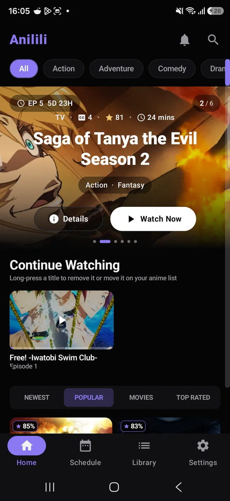
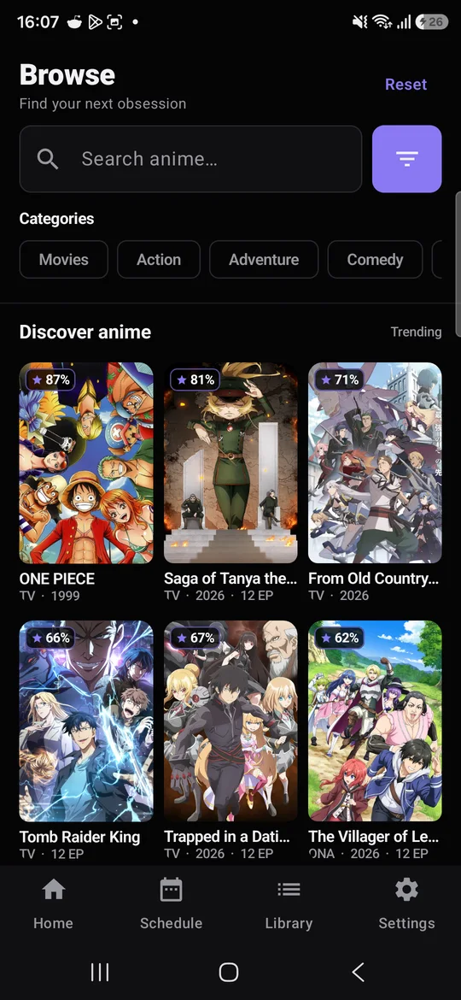
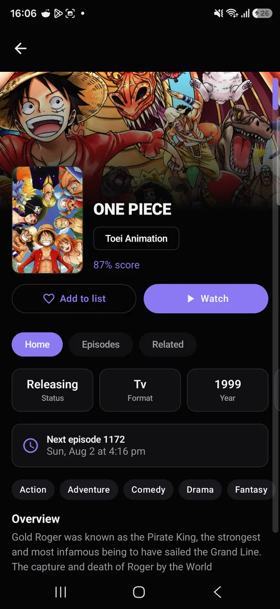
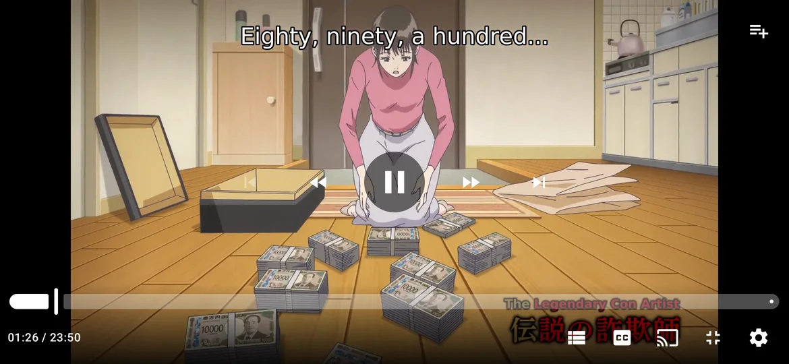
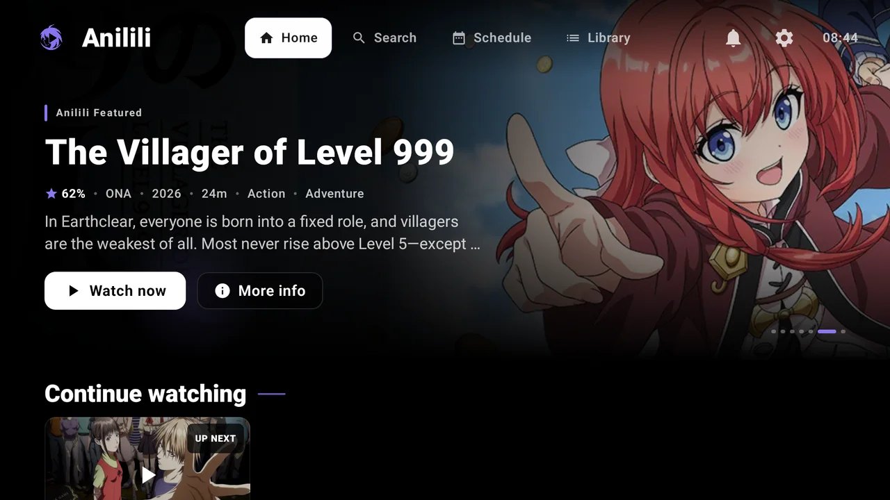
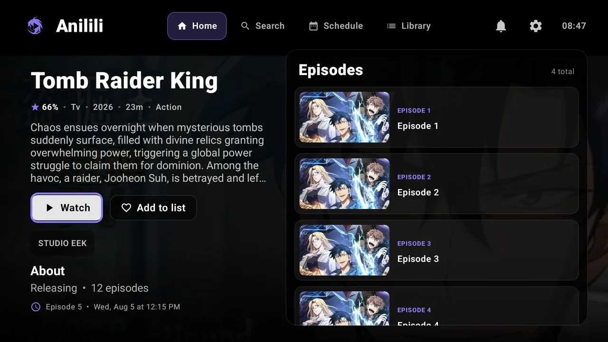
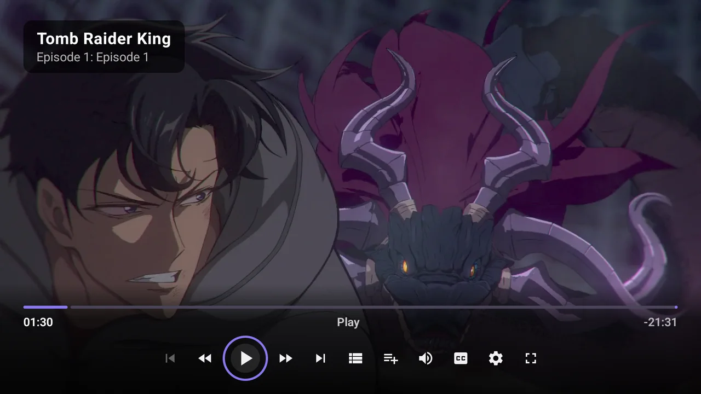

  

<h1 align="center">Anilili</h1>

  <strong>Anime, beautifully native on Android.</strong> 
  Fast multi-source playback, offline downloads, AniList/MAL sync, and a remote-first TV experience.

  
  
  
  

  <a href="https://discord.gg/wZmNumfC9">Get the app</a> ·
  <a href="https://github.com/kompoti121/Anilili/releases/latest">Release notes</a> ·
  <a href="https://github.com/kompoti121/Anilili/issues">Report a problem</a>

---

## Made for every Android screen

Anilili is a native Kotlin and Jetpack Compose anime client for phones, tablets, Android TV,
and Fire TV. It combines discovery, streaming, downloads, list management, and progress sync
in one adaptive interface—without wrapping the whole experience in a website.

| Watch your way | Your anime, in sync | Built for the couch |
| --- | --- | --- |
| Native Media3 playback, multiple sources, subtitles, skip intro/outro, quality selection, PiP, casting controls, and offline episodes. | Sign in with AniList or MyAnimeList, update your list from the player, resume episodes, and optionally sync watched progress. | Large-screen layouts, D-pad navigation, visible focus states, TV-safe spacing, and player controls designed for a remote. |

## Mobile experience

<table>
  <tr>
    <th width="33%">Home &amp; continue watching</th>
    <th width="33%">Discover &amp; filter</th>
    <th width="33%">Details &amp; airing info</th>
  </tr>
  <tr>
    <td></td>
    <td></td>
    <td></td>
  </tr>
</table>

  <strong>Native player with episodes, captions, casting, fullscreen, and list controls</strong>  
  

## TV experience

<table>
  <tr>
    <th width="50%">A cinematic, remote-friendly home</th>
    <th width="50%">Details and episodes side by side</th>
  </tr>
  <tr>
    <td></td>
    <td></td>
  </tr>
</table>

  <strong>Fullscreen playback designed around D-pad controls</strong>  
  

## Highlights

- **Multiple streaming sources:** automatic discovery and fallback across Miruro and
  Anivexa-backed providers, with server priority and sub/dub language filtering.
- **Native video player:** Media3 playback with quality selection, audio tracks, captions,
  caption styling and timing, playback speed, content scaling, gestures, PiP, and casting controls.
- **Offline viewing:** background episode downloads, external subtitles, progress notifications,
  offline playback, and optional MP4 export to `Downloads/Anilili/`.
- **AniList and MyAnimeList:** optional login, list views, Add to My List from the player,
  continue watching, resume positions, and watched-episode progress sync.
- **Smart episode controls:** autoplay, skip intro/outro, episode drawer, next/previous navigation,
  and subtitle delay that can persist across a season.
- **Phone and TV interfaces:** adaptive Compose layouts for touch, D-pad, Android TV, Fire TV,
  tablets, landscape playback, and older low-memory devices.
- **Useful diagnostics:** shareable support reports containing app, playback, device, network,
  and recent diagnostic information when troubleshooting is needed.

  
<strong>Streaming providers</strong>

Anilili can resolve episodes from Miruro, Senshi, AniBD, AniKoto, KickAssAnime, AllAnime,
AnimeKai, ReAnime, AniZone, AnimeGG, AniNeko, 2DHive, RareAnimes, and additional compatible
sources. Availability can vary by title, language, region, and provider uptime.

## Install

1. Open the Discord server below and download the **Universal APK** posted there.
2. Open the APK and allow installation from Discord or your file manager if Android asks.
3. Launch Anilili. Signing in to AniList or MyAnimeList is optional.

  

On a TV or Fire TV device, take the **TV build** from the same server — transfer it from a phone, or
open Discord on the TV — then install it with the system package installer.

Every build is posted in the group. Pick the file that matches the device; the plain
`Anilili.apk` and `Anilili_tv.apk` run everywhere and are the safe choice if unsure.

### Phones and tablets

| APK | Best for |
| --- | --- |
| `Anilili.apk` | **Recommended.** Universal build, runs on every phone and tablet. |
| `Anilili_arm64-v8a.apk` | Smaller download for modern 64-bit devices. |
| `Anilili_armeabi-v7a.apk` | Older 32-bit devices. |

### Android TV, Google TV and Fire TV

| APK | Best for |
| --- | --- |
| `Anilili_tv.apk` | **Recommended.** Universal TV build. |
| `Anilili_tv_arm64-v8a.apk` | 64-bit TV boxes and newer Fire TV sticks. |
| `Anilili_tv_armeabi-v7a.apk` | 32-bit Fire OS sticks. |

The TV build is the same app tuned for the living room: it drops Google Cast (a TV is where a cast
*ends up*, and Fire TV's Play Services cannot serve the Cast module at all), which makes it about
1 MB smaller and removes a class of start-up failure. Both builds share an application id, so an
existing install updates in place either way — and the in-app updater keeps each device on its own
build.

**Compatibility:** Android 5.1 / Fire OS 5 (API 22) or newer.

## Community and support

The Discord server is the quickest place for release announcements, help, feedback, and
provider-status discussions. For reproducible bugs, you can also open a GitHub issue and attach
the app's shared diagnostics ZIP when appropriate.

  
  

## Disclaimer

Anilili is a personal and educational project. It is not affiliated with AniList,
MyAnimeList, or any streaming provider. The app hosts no video content; streams are resolved
from third-party providers at playback time. Availability and legality can vary by region, and
users are responsible for following the laws and terms that apply to them.
